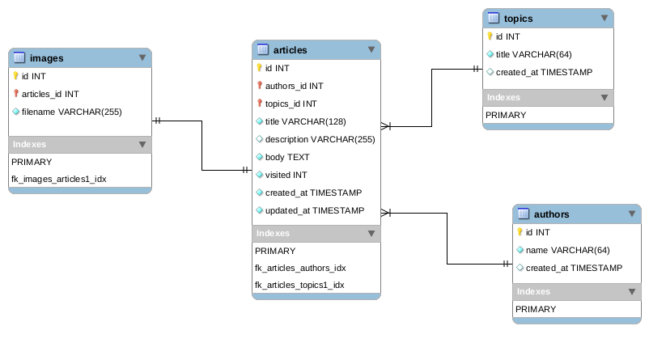
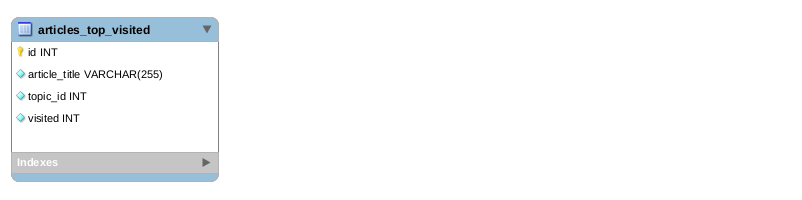

`OWOX PHP School final project`
===========

How to run project
-------
Rename "docker-compose.yml.demo" -> "docker-compose.yml"

docker-compose up

Than run next commands:
docker-compose exec main-php-fpm composer install
docker-compose exec main-php-fpm composer run-script set-up

docker-compose exec service-php-fpm composer install
docker-compose exec service-php-fpm composer run-script set-up

Hosts
-------
Add to /etc/hosts
127.0.0.1   myproject.ll
127.0.0.1   admin.myproject.ll
127.0.0.1   service.myproject.ll

Main Project Database Diagram
-----------

Service Project Database Diagram
-----------

Examples
--------

-  PHPUnit: Mock Builder